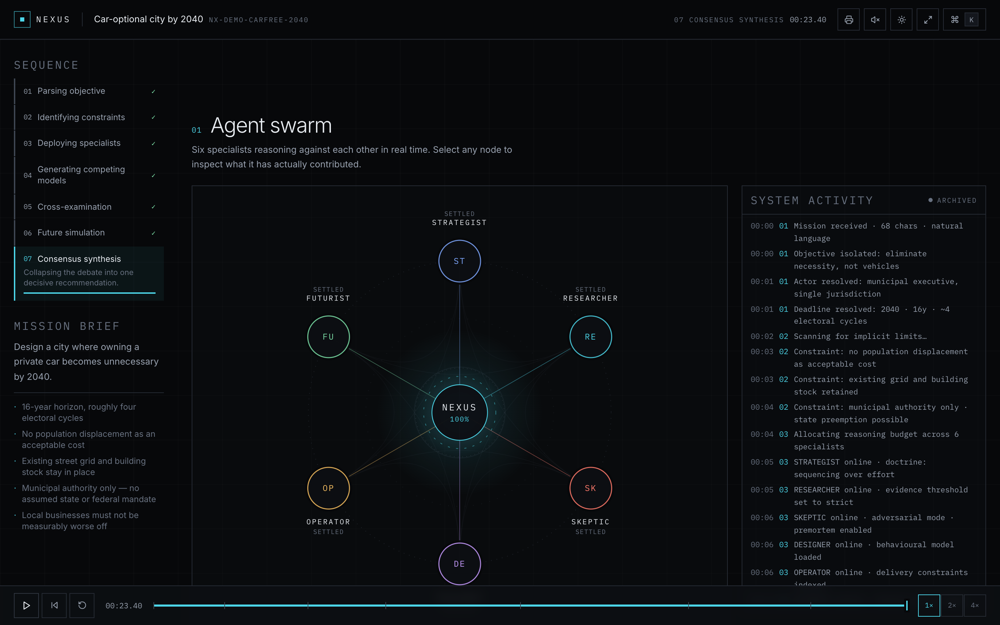
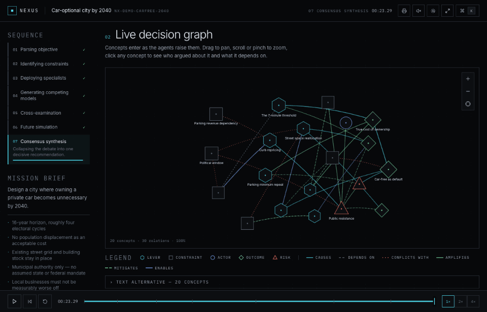
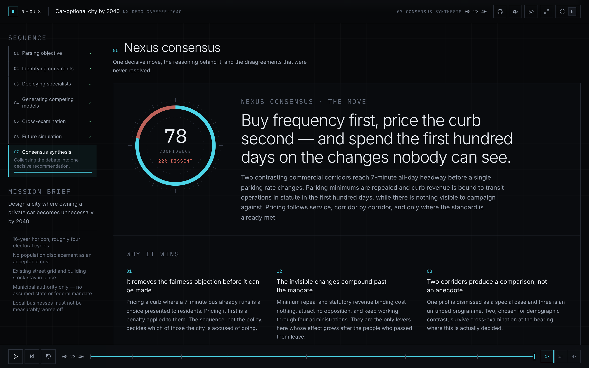

# NEXUS — Autonomous Future Lab

**[Open the live lab →](https://saithej2k.github.io/nexus-lab/)**

A decision laboratory. Give it a mission with no obvious answer and watch six specialist agents
build competing models of it, attack each other's assumptions, grow a live decision graph, branch
three futures, and converge on one decisive move — with their unresolved disagreements left visible.

The transcript is not the interface. Watching the reasoning organise itself is.



```bash
npm install
npm run dev      # http://localhost:8080
npm run build    # typecheck + production bundle
npm run lint
```

No account, no credentials, no backend. Open it and press **Initialize Nexus**, or **Load demo**.

## The replay

The live run and the replay are the same render at a different point on one timeline. Drag the
scrubber backwards and the decision graph deconstructs itself — concepts leave in the reverse of
the order the agents raised them, the phase ladder rewinds, and the clock runs down with it.



There is no separate replay mode. Every component reads from a single position `t`, so "playing"
and "scrubbing" are the same code path.

## What's in it

| Surface | What it does |
| --- | --- |
| **Agent constellation** | Six specialists on a live SVG ring — dormant, waking, reasoning, transmitting, settled. Data pulses travel the spokes; debate replies fire visible chords between the two agents involved. |
| **Live decision graph** | Concepts enter the graph as agents raise them. Pan, zoom, pinch, recenter. Shape encodes concept type, dash pattern encodes relation, so nothing depends on colour. Full text alternative below the canvas. |
| **Cross-examination** | Proposal → challenge → revision → decision, with a confidence trace showing where each argument actually changed its mind. Threads that never resolved stay marked open. |
| **Future simulator** | Three branches drawn from one present. Selecting one rewrites the Year 1/3/5/10 timeline beneath it. |
| **Consensus** | A graduated confidence ring that draws agreement and dissent on the same scale, then the briefing. |
| **Decision DNA** | A six-axis banding strip — deliberately not a radar chart — that gives each mission a recognisable silhouette. |
| **Command palette** | `⌘K` / `Ctrl+K`. Navigation, agent inspectors, focus mode, theme, sound — and `/singularity`. |

## The briefing

The run ends in an intelligence briefing, not a blog post: the move, why it wins, the first 72
hours, critical assumptions with confidence, kill conditions with thresholds, second-order effects,
and the questions the agents never agreed on.



## Architecture

```
src/
  lib/
    types.ts          Mission, Agent, AgentInsight, DebateEvent, DecisionNode,
                      DecisionEdge, Scenario, Milestone, Consensus, DecisionDNA
    agents.ts         Agent roster, phase ladder, relation/kind metadata — the token layer
    sources.ts        SimulationSource implementations + runMission() entry point
    validate.ts       Structural validation and repair for untrusted external JSON
    engine/           Deterministic reasoning engine (skeleton + domain packs)
  data/demo/          The hand-authored flagship analysis
  hooks/useNexus.tsx  Single clock, phase derivation, visibility, agent state
  components/
    nexus/ agents/ graph/ debate/ scenarios/ consensus/ simulation/ command/ ui/
```

Three layers, cleanly separated:

1. **Simulation sources** — anything that can produce an `Analysis`.
2. **State** — one animation-frame clock in `useNexus`. Everything on screen is derived from a
   single timeline position `t`, which is exactly why replay works without a second code path.
3. **Presentation** — components that know only about the domain types.

### Simulation sources

- `demoSource` — the hand-authored car-free-2040 analysis.
- `engineSource` — a deterministic engine that composes a full analysis for *any* mission text. It
  reasons with a universal strategic skeleton (leverage, sequencing, funding, adoption, opposition,
  second-order effects, irreversibility) and a domain pack supplying the vocabulary and the concepts
  specific to that field. Seeded by a hash of the mission, so the same text always yields the same
  analysis.
- `remoteSource` — optional. Set `VITE_NEXUS_ANALYSIS_ENDPOINT` to a **server** route that returns
  an `Analysis`-shaped JSON document. Responses are schema-validated and repaired
  (`src/lib/validate.ts`); timeouts, malformed payloads, and network failures fall back to the
  deterministic engine silently. No secret ever reaches the browser.

Because analyses are deterministic, the mission text is the share link — `/?m=<mission>` reproduces
an identical analysis with no backend involved. `&at=end` opens it at a moment on the timeline, and
`#section-consensus` jumps straight to a section.

## Accessibility

Semantic sections, keyboard-operable constellation and graph nodes, visible focus rings, ARIA labels
and live regions, meters that always state their number, non-colour encodings for every state, and
an expandable text alternative for the decision graph. `prefers-reduced-motion` skips the run
theatre entirely and delivers the finished analysis.

## Notes

- Motion never gates content. Nothing on the page fades in from zero opacity on mount, so a stalled
  frame loop can't leave a section invisible.
- Sound is synthesised with the Web Audio API — no assets, no autoplay, muted by default.
- The printer button exports the briefing as a light-themed print document.
- Dark mode is the designed default; light mode is a token swap in `src/styles/globals.css`.
- Deployed by GitHub Actions to Pages on every push to `main`.
